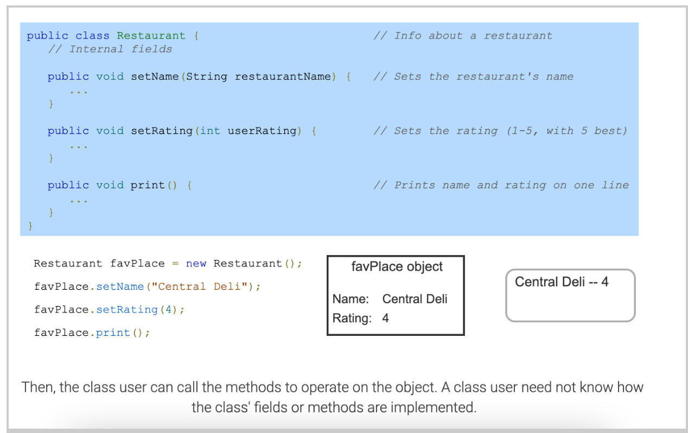
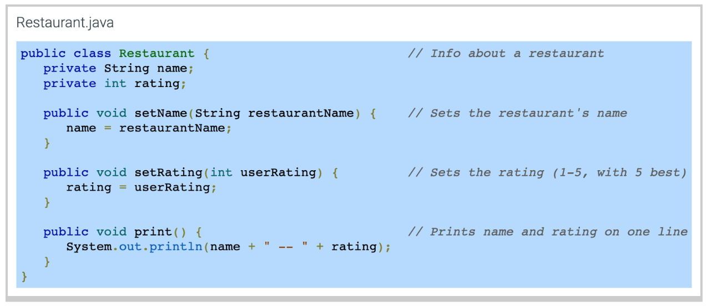
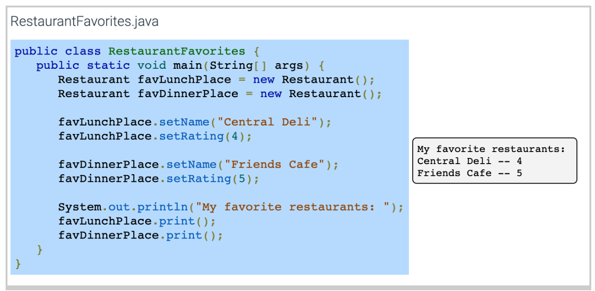
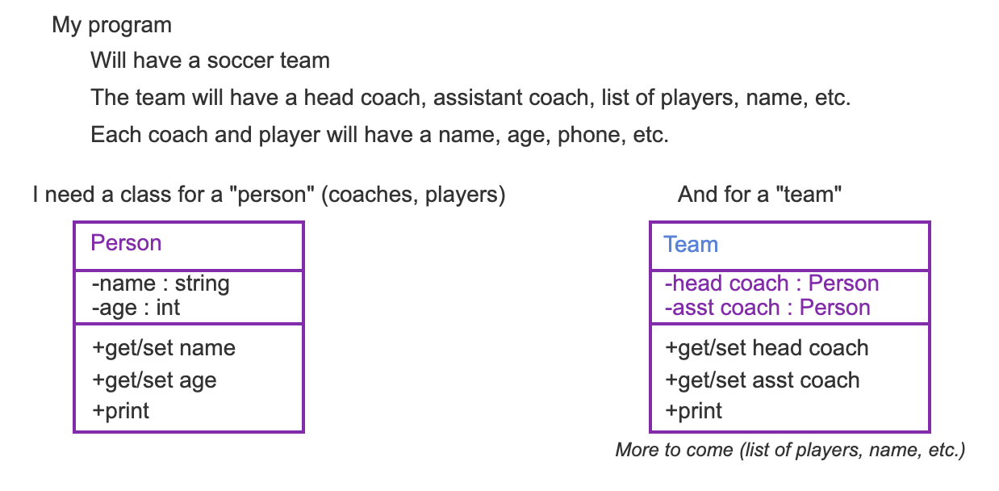
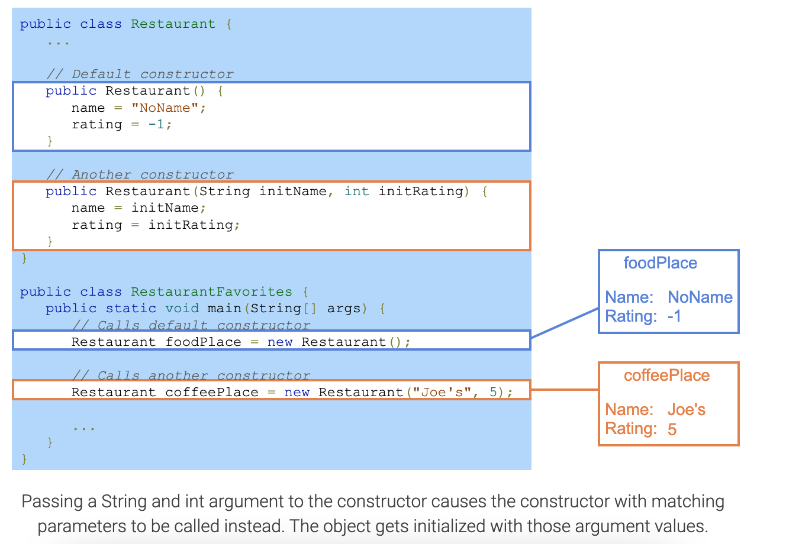
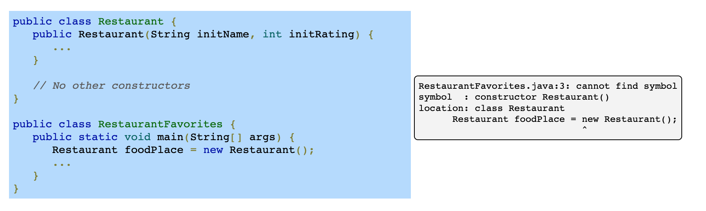
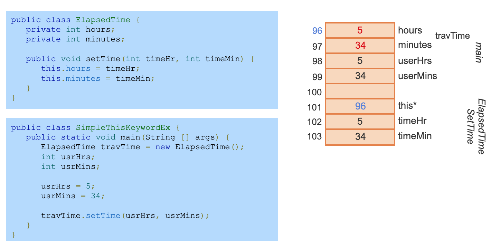

# Introduction to objects
## Grouping things into objects
The physical world comprises material items like wood, metal, plastic, fabric, etc. To keep the world understandable, people deal with higher-level objects, like chairs, tables, and TV's. Those objects are groupings of lower-level items.

Likewise, a program is made up of items like variables and methods. To keep programs understandable, programmers often deal with higher-level groupings of those items known as objects. In programming, an object is a grouping of data (variables) and operations that can be performed on that data (methods).

## Abstraction
Abstraction means to have a user interact with an item at a high-level, with lower-level internal details hidden from the user (aka information hiding or encapsulation). Ex: An oven supports an abstraction of a food compartment and a knob to control heat. An oven's user need not interact with the internal parts of an oven.

Objects strongly support abstraction, hiding entire groups of methods and variables and exposing only certain methods to a user.

An abstract data type (ADT) is a data type whose creation and update are constrained to specific well-defined operations. A class can be used to implement an ADT.

# Using a class
## Classes intro: Public member methods
The class construct defines a new type that can group data and methods to form an object. A class' public member methods indicate all operations a class user can perform on the object. The power of classes is that a class user need not know how the class' data and methods are implemented but need only understand how each public member method behaves.



## Using a class
A programmer can create one or more objects of the same class. Creating an object consists of two steps: declaring a reference variable of the class type, and assigning the variable with an explicitly allocated instance of the class type. A reference variable can refer to an instance of a class. The new operator explicitly allocates an object of the specified class type. Ex: Restaurant favLunchPlace = new Restaurant(); creates a Restaurant object named favLunchPlace.

The "." operator, known as the member access operator, is used to invoke a method on an object. Ex: favLunchPlace.setRating(4) calls the setRating() method on the favLunchPlace object, which sets the object's rating to 4.


### Class example: String
Java's String object is a class that stores a character string in memory, along with variables indicating the length and other things, but a String's user need not know such details. Instead, the String's user just needs to know what public member methods can be used.

# Defining a class
## Private fields
In addition to public member methods, a class definition has private fields: variables that member methods can access but class users cannot. The private access modifier precedes each private field declaration.


## Defining a class public member methods
A programmer defining a class first names the class, declares private fields, and defines public member methods. A class' fields and methods are collectively called class members.

The programmer defines the details of each member method, sometimes called the class' implementation. A method definition provides an access modifier, return type, name, parameters, and the method's statements. A member method can access all private fields.




### Example - Bicycle class
The following class gives an overview of how a class, constructor and methods are defined.
<details><summary>Click to get the code</summary>
<p>

``` java
public class Bicycle { 
    // the Bicycle class has three fields
    public int cadence;
    public int gear;
    public int speed;
       

    // the Bicycle class has one constructor
    public Bicycle(int startCadence, int startSpeed, int startGear) {
        gear = startGear;
        cadence = startCadence;
        speed = startSpeed;
    }
    // the Bicycle class has four methods
    public void setCadence(int newValue) {
        cadence = newValue;
    }  
    public void setGear(int newValue) {
        gear = newValue;
    }   
    public void applyBrake(int decrement) {
        speed -= decrement;
    }   
    public void speedUp(int increment) {
        speed += increment;
    }   
}
```
</p>
</details>

### Example - PersonInfo class
<details><summary>Click to get the code</summary>
<p>
    
```java
import java.util.Scanner;
public class CallPersonInfo {

    public static void main(String [] args) {
        Scanner scnr = new Scanner(System.in);
        PersonInfo person1 = new PersonInfo();
        int personsKid;

        System.out.println("Enter number of kids: ");
        personsKid = scnr.nextInt();

        person1.setNumKids(personsKid);

        System.out.println("Kids: " + person1.getNumKids());
        person1.incNumKids();
        System.out.println("New baby, kids now: " + person1.getNumKids());

    }

}

class PersonInfo {
    private int numKids;

    public void setNumKids(int setPersonsKids) {
        numKids = setPersonsKids;
    }

    public void incNumKids() {
        numKids = numKids + 1;
    }

    public int getNumKids() {
        return numKids;
    }
}
```
</p>
</details>

# Mutators, accessors, and private helpers

## Mutators and accessors
A class' public methods are commonly classified as either mutators or accessors.

A **mutator** method may modify ("mutate") a class' fields.
An **accessor** method accesses fields but may not modify a class' fields.
Commonly, a field has two associated methods: a mutator for setting the value, and an accessor for getting the value, known as a setter and getter method, respectively, and typically with names starting with set or get. Other mutators and accessors may exist that aren't associated with just one field, such as the print() method below.

### Example
<details><summary>Click to get the code</summary>
<p>

``` java
public class MyRestaurant {
    public static void main(String[] args) {
        Restaurant myPlace = new Restaurant();
        myPlace.setName("Maria's Diner");
        myPlace.setRating(5);
        System.out.print(myPlace.getName() + " is rated ");
        System.out.println(myPlace.getRating());
    }
}
class Restaurant {
    private String name;
    private int rating;

    public void setName(String restaurantName) {  // Mutator
        name = restaurantName;
    }

    public void setRating(int userRating) {       // Mutator
        rating = userRating;
    }

    public String getName() {  // Accessor
        return name;
    }

    public int getRating() {  // Accessor
        return rating;
    }

    public void print() {      // Accessor
        System.out.println(name + " -- " + rating);
    }
}
```

</p>
</details>

## Private helper methods
A programmer commonly creates private methods, known as private helper methods, to help public methods carry out tasks.


# Initialization and constructors

> A good practice is to initialize all variables when declared. This section deals with initializing the fields of a class when a variable of the class type is allocated.

## Field initialization
A programmer can initialize fields in the field declaration. Any object created of that class type will initially have those values.

### Example: A class definition with initialized fields
<details><summary>Click to get the code</summary>
<p>
    
``` java
public class RestaurantFavorites {
    public static void main(String[] args) {
        Restaurant_f favLunchPlace = new Restaurant_f(); // Initializes fields with values in class definition

        favLunchPlace.print();

        favLunchPlace.setName("Central Deli");
        favLunchPlace.setRating(4);

        favLunchPlace.print();
    }
}

class Restaurant_f {
    private String name = "NoName";
    private int rating = -1;

    public void setName(String restaurantName) {
        name = restaurantName;
    }

    public void setRating(int userRating) {
        rating = userRating;
    }

    public void print() {
        System.out.println(name + " -- " + rating);
    }
}
```
</p>
</details>

## Constructors
Java provides a special class member method, known as a constructor, that is called when an object of that class type is created, and which can be used to initialize all fields. The constructor has the same name as the class. The constructor method has no return type, not even void. Ex: public Restaurant() {...} defines a constructor for the Restaurant class.

A programmer specifies the constructor that should be called when creating an object. Ex: Restaurant favLunchPlace = new Restaurant(); creates a new Restaurant object and calls the constructor Restaurant().

If a class does not have a programmer-defined constructor, then the Java compiler implicitly defines a default constructor with no arguments. The Java compiler also initializes all fields to their default values.

### Example: Adding a constructor member method to the Restaurant class.
<details><summary>Click to get the code</summary>
<p>
    
``` java
public class RestaurantFavorites {
    public static void main(String[] args) {
        Restaurant_f favLunchPlace = new Restaurant_f(); // Calls the constructor
        favLunchPlace.print();
        favLunchPlace.setName("Central Deli");
        favLunchPlace.setRating(4);
        favLunchPlace.print();
    }
}

class Restaurant_f {
    private String name;
    private int rating;

    public Restaurant_f() {  // Constructor with no arguments
        name = "NoName";    // Default name: NoName indicates name was not set
        rating = -1;        // Default rating: -1 indicates rating was not set
    }

    public void setName(String restaurantName) {
        name = restaurantName;
    }

    public void setRating(int userRating) {
        rating = userRating;
    }

    public void print() {
        System.out.println(name + " -- " + rating);
    }
}
```
</p>
</details>

Further details can be found at:  
    - [Constructors from Oracle's Java tutorials](https://docs.oracle.com/javase/tutorial/java/javaOO/constructors.html)  
    - [Initializing fields from Oracle's Java tutorials](https://docs.oracle.com/javase/tutorial/java/javaOO/initial.html)  

# Choosing classes to create
## Decomposing into classes
Creating a program may start by a programmer deciding what "things" exist, and what each thing contains and does.

Below, the programmer wants to maintain a soccer team. The programmer realizes the team will have people, so decides to sketch a Person class. Each Person class will have private (shown by "-") data like name and age, and public (shown by "+") methods like get/set name, get/set age, and print. The programmer then sketches a Team class, which uses Person objects.



### Example: SoccerTeam and TeamPerson classes
<details><summary>Click to get the TeamPerson class</summary>
<p>

``` java
\\ TeamPerson.java
public class TeamPerson {
    private String fullName;
    private int ageYears;

    public void setFullName(String firstAndLastName) {
        fullName = firstAndLastName;
    }

    public void setAgeYears(int ageInYears) {
        ageYears = ageInYears;
    }

    public String getFullName() {
        return fullName;
    }

    public int getAgeYears() {
        return ageYears;
    }

    public void print() {
        System.out.println("Full name: " + fullName);
        System.out.println("Age (years): " + ageYears);
    }
}

```
</p>
</details>

<details><summary>Click to get the SoccerTeam class</summary>
<p>

``` java
\\ SoccerTeam.java
public class SoccerTeam {
    private TeamPerson headCoach;
    private TeamPerson assistantCoach;
    // Players omitted for brevity

    public void setHeadCoach(TeamPerson teamPerson) {
        headCoach = teamPerson;
    }

    public void setAssistantCoach(TeamPerson teamPerson) {
        assistantCoach = teamPerson;
    }

    public TeamPerson getHeadCoach() {
        return headCoach;
    }

    public TeamPerson getAssistantCoach() {
        return assistantCoach;
    }

    public void print() {
        System.out.println("HEAD COACH: ");
        headCoach.print();
        System.out.println();

        System.out.println("ASSISTANT COACH: ");
        assistantCoach.print();
        System.out.println();
    }
}
```
</p>
</details>

<details><summary>Click to get the main method</summary>
<p>

``` java
// main method
public class SoccerTeamPrinter {
    public static void main(String[] args) {
        SoccerTeam teamCalifornia = new SoccerTeam();
        TeamPerson headCoach = new TeamPerson();
        TeamPerson asstCoach = new TeamPerson();

        headCoach.setFullName("Mark Miwerds");
        headCoach.setAgeYears(42);
        teamCalifornia.setHeadCoach(headCoach);

        asstCoach.setFullName("Stanley Lee");
        asstCoach.setAgeYears(30);
        teamCalifornia.setAssistantCoach(asstCoach);

        teamCalifornia.print();
    }
}
```
</p>
</details>

# Defining main() in a programmer-defined class
The main() method can be defined within a programmer-defined class and create objects of that class type. The BasicCar class defined in the example below represents a car that keeps track of the number of miles driven. BasicCar has a field that maintains the miles driven and three methods that set, retrieve, and modify the object's field.

main() is a static method that is independent of class objects. main() can access other static methods and static fields of the class, but cannot directly access non-static methods or fields, like BasicCar's checkOdometer() method. So, a programmer must create objects within main() to call non-static methods on those objects. Ex: BasicCar's main() creates two objects of type BasicCar and performs operations on those objects.

Non-static fields and methods are also called instance variables and instance methods.

### Example: Class definition with main() method.
<details><summary>Click to get the code</summary>
<p>

``` java
public class BasicCar {

    // Total miles driven by the car
    private int milesDriven;

    // Constructor assigns initial values to instance variables
    public BasicCar() {
        milesDriven = 0;
    }

    // Drive the requested miles
    public void drive(int tripMiles) {
        milesDriven = milesDriven + tripMiles;
    }

    // Return total number of miles driven
    public int checkOdometer() {
        return milesDriven;
    }

    // Main() creates objects of type BasicCar and
    // calls methods to operate on the objects
    public static void main(String [] args) {
        BasicCar redCorvette = new BasicCar();
        BasicCar fordMustang = new BasicCar();

        redCorvette.drive(100);
        fordMustang.drive(75);
        fordMustang.drive(300);
        fordMustang.drive(50);
    }
}
```
</p>
</details>

# Unit testing (classes)
## Testbenches
Like a chef who tastes food before serving, a class creator should test a class before allowing use. A testbench is a program whose job is to thoroughly test another program (or portion) via a series of input/output checks known as test cases. Unit testing means to create and run a testbench for a specific item (or "unit") like a method or a class.

### Example: Unit testing of a class
<details><summary>Click to get the code</summary>
<p>

``` java
public class StatsInfoTest {
    public static void main(String[] args) {
        StatsInfo testData = new StatsInfo();

        // Typical testbench tests more thoroughly

        System.out.println("Beginning tests.");

        // Check set/get num1
        testData.setNum1(100);
        if (testData.getNum1() != 100) {
            System.out.println("   FAILED set/get num1");
        }

        // Check set/get num2
        testData.setNum2(50);
        if (testData.getNum2() != 50) {
            System.out.println("   FAILED set/get num2");
        }

        // Check getAverage()
        testData.setNum1(10);
        testData.setNum2(20);
        if (testData.getAverage() != 15) {
            System.out.println("   FAILED GetAverage for 10, 20");
        }

        testData.setNum1(-10);
        testData.setNum2(0);
        if (testData.getAverage() != -5) {
            System.out.println("   FAILED GetAverage for -10, 0");
        }

        System.out.println("Tests complete.");
    }
}

class StatsInfo {

    // Note: This class intentionally has errors

    private int num1;
    private int num2;

    public void setNum1(int numVal) {
        num1 = numVal;
    }

    public void setNum2(int numVal) {
        num2 = numVal;
    }

    public int getNum1() {
        return num1;
    }

    public int getNum2() {
        return num1;
    }

    public int getAverage() {
        return num1 + num2 / 2;
    }
}
```
</p>
</details>

Features of a good testbench include:
- Automatic checks. Ex: Values are compared, as in testData.GetNum1() != 100. For conciseness, only fails are printed.
- Independent test cases. Ex: The test case for GetAverage() assigns new values, vs. relying on earlier values.
- 100% code coverage: Every line of code is executed. A good testbench would have more test cases than below.
- Includes not just typical values but also border cases: Unusual or extreme test case values like 0, negative numbers, or large numbers.

# Constructors overloading
Programmers often want to provide different initialization values when creating a new object. A class creator can overload a constructor by defining multiple constructors differing in parameter types. When an object is created with the new operator, arguments can be passed to the constructor. The constructor with matching parameters will be called.



Creating a new object with no constructor arguments calls the default constructor. In this case, the object gets initialized with NoName and -1.
Passing a String and int argument to the constructor causes the constructor with matching parameters to be called instead. The object gets initialized with those argument values.

> If a programmer defines any constructor, the compiler does not implicitly define a default constructor, so good practice is for the programmer to also explicitly define a default constructor so that an object creation like new MyClass() remains supported.



# Objects and references
## References
A reference is a variable type that refers to an object. A reference may be thought of as storing the memory address of an object. Variables of a class data type (and array types, discussed elsewhere) are reference variables.


A statement like TimeHrMin travelTime; declares a reference to an object of type TimeHrMin, while String firstName; declares a reference to an object of type String. The reference variables do not store data for those class types. Instead, the programmer must assign each reference to an object, which can be created using the new operator.

The statement TimeHrMin travelTime; declares a reference variable with an unknown value. A common error is to attempt to use a reference variable that does not yet refer to a valid object.

The new operator allocates memory for an object, then returns a reference to the object's location in memory. Thus, travelTime = new TimeHrMin(); sets travelTime to refer to a new TimeHrMin object in memory. travelTime now refers to a valid object and the programmer may use travelTime to access the object's methods. The reference variable declaration and object creation may be combined into a single statement: TimeHrMin travelTime = new TimeHrMin();

Java does not provide a direct way to determine the memory location of an object, or to determine the exact address to which a reference variable refers. The "value" of a reference variable is unknown to the programmer. 

# The 'this' implicit parameter
## Implicit parameter
An object's member method is called using the syntax objectReference.method(). The object reference before the method name is known as an implicit parameter of the member method because the compiler converts the call syntax objectReference.method(...) into a method call with the object reference implicitly passed as a parameter. Ex: method(objectReference, ...).

Within a member method, the implicitly-passed object reference is accessible via the keyword this. In particular, a class member can be accessed as this.classMember. The "." is the member access operator.

Using this makes clear that a class member is being accessed and is essential if a field member and parameter have the same identifier. In the example below, this is necessary to differentiate between the field member sideLength and the parameter sideLength.

### Example: Using 'this' to refer to an object's members
<details><summary>Click to get the code</summary>
<p>
    
``` java
public class ShapeTest {
    public static void main(String[] args) {
        ShapeSquare square1 = new ShapeSquare();

        square1.setSideLength(1.2);
        System.out.println("Square's area: " + square1.getArea());
    }
}

class ShapeSquare {
    // Private fields
    private double sideLength;

    // Public methods
    public void setSideLength(double sideLength) {
        this.sideLength = sideLength;
        // Field member    Parameter
    }

    public double getArea() {
        return sideLength * sideLength; // Both refer to field
    }
}
```
</p>
</details>

### Using 'this' in class member methods and constructors
The figure below illustrates how member methods work. When an object's member method is called, the object's reference, which can be thought of as the object's memory address, is passed to the method via the implicit "this" parameter. An access in setTime() to this.hours first goes to the object's address, then to the hours field.



1. travTime is an object of class type ElapsedTime.  
2. When travTime's SetTime() member method is called, travTime's object reference, which can be thought of as the object's memory address, is passed to the method via the implicit 'this' parameter.  
3. The implicitly-passed object reference is accessible within the member method via the keyword 'this'. Ex: this.hours first goes to travTime's memory address, then to the hours data member.  

The "this" keyword can also be used in a constructor to invoke a different (overloaded) constructor. In the default constructor below, this(0, 0); invokes the other constructor to initialize both fields to zero. For this example, a programmer could have just set both fields to zero within the default constructor. However, invoking other constructors is useful when a class' initialization routine is lengthy and avoids rewriting the same code.

Further details can be found at:  
- [Using the 'this' keyword from Oracle's Java tutorials](https://docs.oracle.com/javase/tutorial/java/javaOO/thiskey.html)

# Primitive and reference types
## Wrapper classes

Java variables are one of two types.

- A primitive type variable directly stores the data for that variable type, such as int, double, or char. Ex: int numStudents = 20; declares an int that directly stores the data 20.  
- A reference type variable can refer to an instance of a class, also known as an object.  

Java provides several wrapper classes that are built-in reference types that augment the primitive types. The Integer data type is a built-in class in Java that augments the int primitive type. Ex: Integer maxPlayers = 10; declares an Integer reference variable named maxPlayers that refers to an instance of the Integer class, also known as an Integer object. That Integer object stores the integer value 10.


Many of Java's built-in classes, such as Java's Collection library, only work with objects. For example, a programmer can create an ArrayList containing Integer elements, e.g., ArrayList\<Integer\> frameScores; but not an ArrayList of int elements. Wrapper classes allow the program to create objects that store a single primitive type value, such as an integer or floating-point value. The wrapper classes also provide methods for converting between primitive types (e.g., int to double), between number systems (e.g., decimal to binary), and between a primitive type and a String representation. 
    
| Reference type | Associated primitive type |
| -------------- | --------------------------|
| Character      | char                      |
| Integer        | int                       |
| Double         | double                    |
| Boolean        | boolean                   |
| Long           | long                      |
    
## Memory allocation for wrapper class objects

A programmer may use a wrapper class variable in expressions in the same manner as the primitive type int. An expression may even combine Integers, ints, and integer literals.

A wrapper class object (as well as a String object) is immutable, meaning a programmer cannot change the object via methods or variable assignments after object creation. When the result of an expression is assigned to an Integer reference variable, memory for a new Integer object with the computed value is allocated, and the reference (or address) of this new object is assigned to the reference variable. A new memory allocation occurs every time a new value is assigned to an Integer variable, and the previous memory location to which the variable referred, remains unmodified.


1. timeMins is a primitive type variable. A primitive type variable directly stores the data for that variable type.
2. Assigning the Integer variable timeHrs with the literal 0 assigns timeHrs with a reference to an Integer object with value 0. Note that Java maintains a cache of Integer objects for literal values -128 to 127 (inclusive).
3. timeMins is a primitive type and directly stores the value 400.
4. A new Integer object is created and assigned with 400 / 60, or 6, and timeHrs is updated to refer to that new Integer object.

### Example: Program using the Double class to calculate flight and driving times
<details><summary>Click to get the code</summary>
<p>
    
``` java
import java.util.Scanner;

public class FlyDrive {
    public static void main(String [] args) {
        Scanner scnr = new Scanner(System.in);
        Double distMiles;
        Double hoursFly;
        Double hoursDrive;

        System.out.print("Enter a distance in miles: ");
        distMiles = scnr.nextDouble();

        hoursFly = distMiles / 500.0;
        hoursDrive = distMiles / 60.0;

        System.out.println(distMiles + " miles would take:");
        System.out.println(hoursFly + " hours to fly");
        System.out.println(hoursDrive + " hours to drive");
    }
}
```
</p>
</details>

**Note**
> When using a literal for initialization, the programmer must ensure that the literal's value falls within the appropriate numeric range, e.g., -2,147,483,648 to 2,147,483,647 for an integer. The wrapper classes (except for Character and Boolean) declare the MAX_VALUE and MIN_VALUE fields, which are static fields initialized with the maximum and minimum values a type may represent, respectively. A programmer may access these fields to check the supported numeric range by typing the wrapper class' name followed by a dot and the field name, as in Integer.MIN_VALUE, which returns -2,147,483,648.

## Comparing wrapper class objects
For reference variables of wrapper classes (e.g., Integer, Double, Boolean), a common error is to use the equality operators == and != when comparing values, which does not work as expected. Using the equality operators on any two reference variables evaluates to either true or false depending on each operand's referenced object. For example, given two Integers num1 and num2, the expression num1 == num2 compares if both num1 and num2 reference the same Integer object, but does not compare the Integers' contents. Because those references will (usually) be different, num1 == num2 will evaluate to false. This is not a syntax error, but clearly a logic error.

Although a programmer should never compare two reference variables of wrapper classes using the equality operators, a programmer may use the equality operators when comparing a wrapper class object with a primitive variable or a literal constant. The relational operators <, <=, >, and >= may be used to compare wrapper class objects. However, note that relational operators are not typically valid for other reference types. The following table summarizes allowable comparisons.

### Comparing wrapper class objects using relational operators


Reference variables of wrapper classes can also be compared using the equals() and compareTo() methods. These method descriptions are presented for the Integer class, but apply equally well to the other wrapper classes. Although the use of comparison methods is slightly cumbersome in comparison to relational operators, these comparison methods may be preferred by programmers who do not wish to memorize exactly which comparison operators work as expected.

### equals() and compareTo() methods for wrapper class types


# Wrapper class conversions
## Autoboxing and unboxing

Java allows statements to combine primitive and wrapper class variables by automatically converting between primitive types and wrapper classes. **Autoboxing** is the automatic conversion of primitive types to the corresponding wrapper classes. **Unboxing** is the automatic conversion of wrapper class objects to the corresponding primitive types.

### Common autoboxing scenarios


### Common unboxing scenarios


### Converting to primitive types
The Integer, Double, and Long wrapper classes provide methods for converting objects to primitive types.


The Character and Boolean classes support the charValue() and booleanValue() methods, respectively, which perform similar functions.

### Converting to and from Strings
Wrapper classes feature methods that are useful for converting to and from Strings. Several of these methods are static methods, meaning they can be called by a program without creating an object. To call a static method, the name of the class and a '.' must precede the static method name, as in  Integer.toString(16);.


### Example: A program to convert a decimal number to binary
<details><summary>Click to get the code</summary>
<p>
    
``` java
import java.util.Scanner;

public class DecimalToBinary {
   public static void main(String [] args) {
      Scanner scnr = new Scanner(System.in);
      int decimalInput;
      String binaryOutput;
      
      System.out.print("Enter a decimal number: ");
      decimalInput = scnr.nextInt();
      
      binaryOutput = Integer.toBinaryString(decimalInput);
      
      System.out.println("The binary representation of " + decimalInput +
                         " is " + binaryOutput);
   }
}

```
</p>
</details>

# ArraysList
## Introduction

Sometimes a programmer wishes to maintain a list of items, like a grocery list, or a course roster. An ArrayList is an ordered list of reference type items that comes with Java. Each item in an ArrayList is known as an element. The statement import java.util.ArrayList; enables use of an ArrayList.

The declaration ArrayList\<Integer\> vals = new ArrayList\<Integer\>() creates reference variable vals that refers to a new ArrayList object consisting of Integer objects. The ArrayList list size can grow to contain the desired elements. ArrayList does not support primitive types like int, but rather reference types like Integer. A common error among beginners is to declare an ArrayList of a primitive type like int, as in ArrayList\<int\> myVals, yielding a compilation error: "unexpected type, found : int, required: reference."


1. valsList is a reference variable that refers to an ArrayList object consisting of Integer objects.  \\
2. Java automatically creates an Integer object from the integer literal passed to the add() method. The add() method then adds the Integer object to the end of the ArrayList.  \\
3. The get() method returns the element at the specified list location.  \\
4. The set() method replaces the element at the specified list position with the new Integer object. Again, Java automatically converts the integer literal 119 to an Integer object with that value.  \\

**Common ArrayList methods**


    
